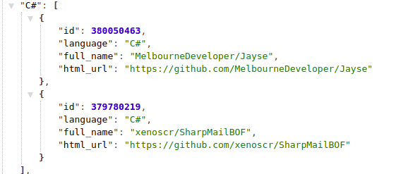
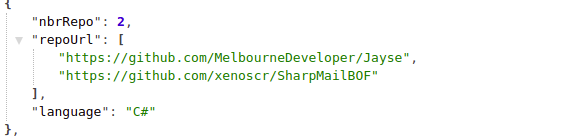

# backend-coding-challenge
- Develop a REST microservice that list the languages used by the 100 trending public repos on GitHub.
    - Number of repos using this language
    - The list of repos using the language

# for run the application

```docker build -t backend-coding-challenge .```


```docker run --name container_name -p 9090:9090 backend-coding-challenge```

# the application has two end points :

/api/repositorie :



/api/repositorie/statistique :


         
